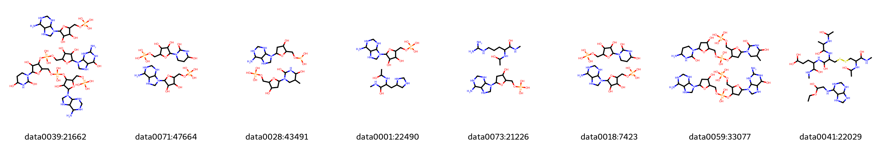

# Biomolecular Structure OMOL25 Analysis Pipeline

<p align="center">
  
</p>

## Overview
This project provides a complete workflow for processing, filtering, and analyzing large datasets of biomolecular structures (specifically dimers containing nucleotides) stored in ASE database files (`.aselmdb`).

The pipeline performs three main tasks:
1.  **Extraction & Conversion:** Reads raw 3D geometries, filters them based on composition/size, and converts them into 2D chemical representations (SMILES).
2.  **Structural Validation:** Analyzes connectivity and fragmentation to ensure data quality.
3.  **Chemical Analysis:** Classifies molecules by substructure (Nucleobases, Sugars, Phosphates) and generates statistical reports on dataset homogeneity.

**Note:** The raw database files (large binaries, `.xyz` directories) are excluded from this repository via `.gitignore`.

## Repository Structure

```text
.
├── filter_and_extract.py   # Core ETL script: ASE db -> Filter -> SMILES/XYZ
├── analysis.py             # Main analysis logic (substructure matching)
├── count_fragments.py      # Quality control: checks for fragmented molecules
├── phosphate_summary.py    # Checks phosphate group presence
├── count_dimer_types.py    # Calculates ocurrence of different dimer categories
├── homogeneity.py          # Statistical check for dataset bias
├── distance_analysis.py    # Analysis of minimal intermolecular distance
├── queries.py              # SMARTS patterns for chemical matching
├── environment.yml         # Conda environment configuration
├── output_filtered_data/   # [Generated] Stores processed coordinates
└── analysis_results/       # [Generated] Stores analysis results
```

## Setup

> [!WARNING]
> **Large Data:** The OMOL25 4M subset is approximately **19 GB** compressed and about **22 GB** extracted. Ensure you have enough of free disk space before proceeding. The generated `output_filtered_data` is about 1.7 GB with the applied filters.

### 1. Download the Data
   Visit the [Facebook Hugginface site](https://huggingface.co/facebook/OMol25/blob/main/DATASET.md) to view the full dataset documentation.
   
   Direct download link: [train_4M.tar.gz (19 GB)](https://dl.fbaipublicfiles.com/opencatalystproject/data/omol/250514/train_4M.tar.gz)

### 2. Extraction
   Extract the archive into the project root. The directory must be named `train_4M/` for the scripts to find it.
   The extracted directory shoul be named `./train_4M` and contain 79 `.aselmdb` and `.aselmdb-lock` files.
   ```bash
   tar -xvzf train_4M.tar.gz
   ```

> [!NOTE]
> **Performance:** The __`filter_and_extract.py`__ script takes approximately **3 minutes per `.aselmdb` file**.
> *To quickly test the pipeline or get a feel for the molecules, I recommend initially running the script with only a small subset (1-3 files) in the `train_4M/` folder.*

### 3. Project directory

This project uses Conda for dependency management to ensure reproducibility with RDKit and ASE.

- Clone the repository:

```bash
git clone https://github.com/jansa249/omol_db_filtering.git
cd omol_db_filtering
```

### 4. Environment

- Create the environment:

```bash
conda env create -f environment.yml
```

- Activate the environment:

```bash
conda activate omol25_db
```

## Usage
### 1. Data Preparation

Make sure you downloaded the OMOL25 subset and extracted it to a directory named `train_4M/` in the project root (simply the directory you cloned).
(Note: The `train_4M` directory is ignored by Git).

### 2. Extraction Pipeline

Run the extraction script to process the raw databases. This filters molecules (keeping only dimers with specific elements) and generates the index CSV.

```bash
python filter_and_extract.py
```
Input: `train_4M/*.aselmdb`
Output: `output_filtered_data/molecule_index.csv` and `output_filtered_data/coordinates/`

The filters can be adjusted in the `filter_pipeline` function:

```python
def filter_pipeline(structure, mol_info):
    n_components, mol_data = mol_info
    
    # 1. Filter by data_id
    if structure.data.get('data_id') != 'biomolecules':
        return False
    
    # 2. Filter by component size (e.g., dimer)
    if n_components != 2:
        return False
    
    # 3. Filter by heavy atoms per component (ignores e.g., ethanol or water)
    if not all(m['heavy_count'] > 5 for m in mol_data):
        return False
        
    # 4. Filter by elements
    allowed = {'C', 'H', 'N', 'O', 'S', 'P'}
    # Composition string parsing
    present_elements = set(re.findall(r'[A-Z][a-z]?', structure.data.composition))
    if not present_elements.issubset(allowed):
        return False

    return True
```

### 3. Analysis & Validation

Once the data is extracted, run the analysis tools in any order:
Substructure Search: Identifies nucleobases and generates grid visualizations for a random subset of the nucleobase set in `analysis_results`.

```bash
python analysis.py
```

Homogeneity Check: Calculates the distribution of Sugar/Base/Phosphate profiles to detect dataset bias.

```bash
python homogeneity.py
```

Fragment Quality Control: Checks for molecules that have broken into unexpected fragments.
*The filters for 2 component structures are not perfect so it might recognize close 3-molecule structures incorrectly*

```bash
python count_fragments.py
```

Type Interaction Matrix: Finds different types of monomers in the complexes based on queries.py

```bash
python count_dimer_types.py
```

Analysis of distances: Computes the distribution of closest distances between heavy atom s in the complexed molecules

```bash
python distance_analysis.py
```

## Outputs

The pipeline generates several key outputs in analysis_results/ and output_filtered_data/:
- `output_filtered_data/molecule_index.csv`: Master list of all processed IDs and their SMILES.
- `output_filtered_data/data*/[ID]_[COMPOSITION]/complex.xyz` and `~/ component_*.xyz`: Extracted 3D coordinates for every filtered molecule.
- `analysis_results/matches_*.csv`: Subsets of data matching specific queries (e.g., Adenine, Guanine).
- `analysis_results/grid_*.png`: Visual grids of molecular structures for quick inspection.
- `analysis_results/distance_distribution.png`: Plot of closest intermolecule contacts in the set
- `analysis_results/distance_extremes/*.xyz`: Coordinates of closest structures calculated by `distance_analysis.py`
